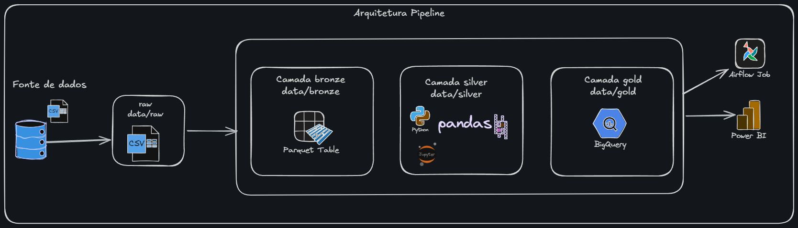
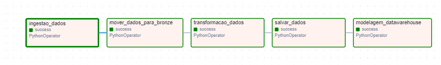

# 🛒 E-commerce Analytics Pipeline - Olist

Um projeto de Engenharia de Dados *End-to-End* construído com **Arquitetura Medalhão** (Bronze, Silver, Gold) e modelo ELT. O pipeline automatiza a ingestão de dados reais de e-commerce, processamento local e modelagem analítica na nuvem utilizando Apache Airflow, Docker e Google BigQuery.

---

## 🎯 O Problema de Negócio
Lidar com dados fragmentados de vendas, clientes e logística é um dos maiores desafios do e-commerce. Este projeto simula um cenário real onde dados brutos precisam ser extraídos diariamente de uma fonte externa (API), tratados para reduzir custos de armazenamento e cruzados na nuvem para gerar inteligência de negócio. 

O objetivo final é entregar um Data Warehouse estruturado em *Star Schema*, pronto para o time de Business Intelligence plugar o Power BI e analisar métricas de faturamento e tempo de entrega.

---

## 🏗️ Arquitetura do Pipeline



O fluxo de dados é orquestrado pelo Airflow e segue o padrão Medalhão:
1. **Extract (Bronze):** Download dos dados brutos `.csv` direto da API do Kaggle.
2. **Transform (Silver):** Limpeza com Python/Pandas e conversão para `.parquet` (compressão de dados e tipagem forte).
3. **Load (BigQuery):** Upload dinâmico dos arquivos Parquet para tabelas no Google BigQuery via autenticação por *Service Account*.
4. **Transform (Gold):** Execução nativa de consultas SQL dentro do BigQuery para a criação do *Star Schema*.

---

## ⚙️ Orquestração (Apache Airflow)

O coração do projeto é o Apache Airflow rodando isolado em containers Docker. A DAG garante que todo o fluxo seja executado na ordem correta, lidando com dependências e *retries* em caso de falha de conexão com a nuvem.



---

## 🛠️ Stack Tecnológico
* **Linguagem:** Python 3 (Pandas, PyArrow)
* **Orquestração & Infra:** Apache Airflow rodando em Docker Compose
* **Cloud & Data Warehouse:** Google Cloud Platform (GCP) e BigQuery
* **Modelagem:** SQL (Star Schema)

---

## 📁 Estrutura do Repositório

```text
📦 E-commerce-Analytics-Olist
 ┣ 📂 airflow-docker        # Configurações e docker-compose do Apache Airflow
 ┃ ┣ 📂 dags                # DAGs do Airflow (dag_pipeline.py)
 ┃ ┗ 📜 docker-compose.yaml
 ┣ 📂 assets                # Imagens para o README
 ┣ 📂 data                  # Armazenamento local temporário (Raw/Bronze/Silver)
 ┣ 📂 logs                  # Logs de execução dos scripts Python
 ┣ 📂 pipeline              # Scripts de ingestão e processamento (Python)
 ┃ ┣ 📂 extract             # Módulos Kaggle API e Raw-to-Bronze
 ┃ ┣ 📂 transform           # Conversão Silver (Parquet) e Orquestrador Gold (SQL)
 ┃ ┗ 📂 load                # Módulo de integração com Google BigQuery
 ┣ 📂 sql                   # Consultas SQL para modelagem do Data Warehouse
 ┣ 📜 .env.example          # Template de variáveis de ambiente
 ┗ 📜 README.md
```

🚀 Como Executar o Projeto
1. Pré-requisitos
Docker instalado na máquina.
Uma conta no Google Cloud Platform (GCP) com a API do BigQuery ativada.
Uma Service Account do GCP com permissões de Editor do BigQuery (Arquivo de chave .json).

2. Configuração do Ambiente
Clone o repositório para a sua máquina local:
Bash
git clone [https://github.com/tailansanttos/E-commerce-Analytics-Olist.git](https://github.com/tailansanttos/E-commerce-Analytics-Olist.git)
cd E-commerce-Analytics-Olist
Coloque o arquivo de credenciais da sua Service Account (sua-chave-gcp.json) dentro da pasta pipeline/.
Em seguida, crie um arquivo chamado .env na raiz do projeto com o seguinte conteúdo, apontando para o caminho correto dentro do container:


GOOGLE_APPLICATION_CREDENTIALS="/opt/airflow/pipeline/sua-chave-gcp.json"
3. Subindo a Infraestrutura
Inicie o cluster do Airflow via terminal:

Bash
cd airflow-docker
docker-compose up -d
Acesse a interface visual do Airflow no seu navegador:

URL: http://localhost:8080
Usuário: airflow
Senha: airflow

4. Execução da Pipeline
No painel do Airflow, ligue o toggle da DAG dag_pipeline_ecommerce_olist (Unpause) e clique no botão Trigger DAG (ícone de Play). Você pode acompanhar a execução em tempo real pela aba Graph.
